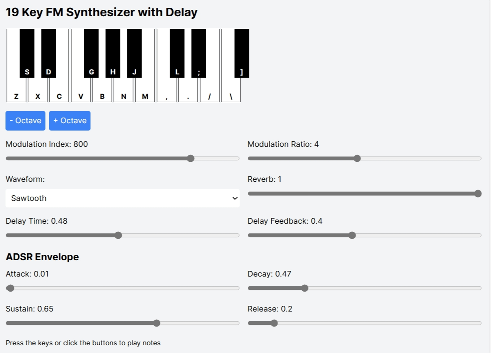

# FM Synthesizer

## Getting Started

This systh was coded by chatGPT and claude 3.5 sonnet.

## Environment

Windows 11, node.js

## Install

```cmd
git clone https://github.com/TaroNakasendo/fm_synth
npm install next@latest react@latest react-dom@latest
```

## Run

```cmd
npm run dev
```

Open [http://localhost:3000](http://localhost:3000) with your browser to see the result.



## Manual

- press [z,s,...,:,\\] key for play the synth.
- click keyboard image for play the synth.

## Deploy

```cmd
npm run build
```

- put out/_next/ as /_next/.
- put other out/ as /fm_synth/.

Open [http://localhost/fm_synth/](http://localhost/fm_synth/) with your browser to see the deploy result.

## License

MIT License
